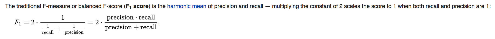

# Classification Metrics

## Accuracy
- Overall, how often is the classifier correct?
- Percent of total that are correctly classified
    - (TP + TN) / Total 
    
## Precision
- When it predicts yes, how often is it correct?
    - **TP / (Predicted YES)**
    
- ratio of the number of correctly labeled responses to the total labeled

## Recall (Sensitivity)
- ratio of the number of correctly labeled responses to the total that should have been labeled
- of all the ones that were **labeled POSITIVE**, which were **really Positive**?
    - **TP / (Actual YES)**    
    - TP / (TP + FN)

## Specificity
- Specificity – how good a test is at **avoiding false alarms**. A test can cheat and maximize this by always returning “negative”.
    - TN / N

## Misclassification Rate
- (FP + FN) / Total

## F1 score
- F1 score (also F-score or F-measure) is a measure of a test's accuracy. It considers both the precision p and the recall r of the test to compute the score
- The F1 score can be interpreted as a weighted average of the precision and recall, where an F1 score reaches its best value at 1 and worst at 0.

