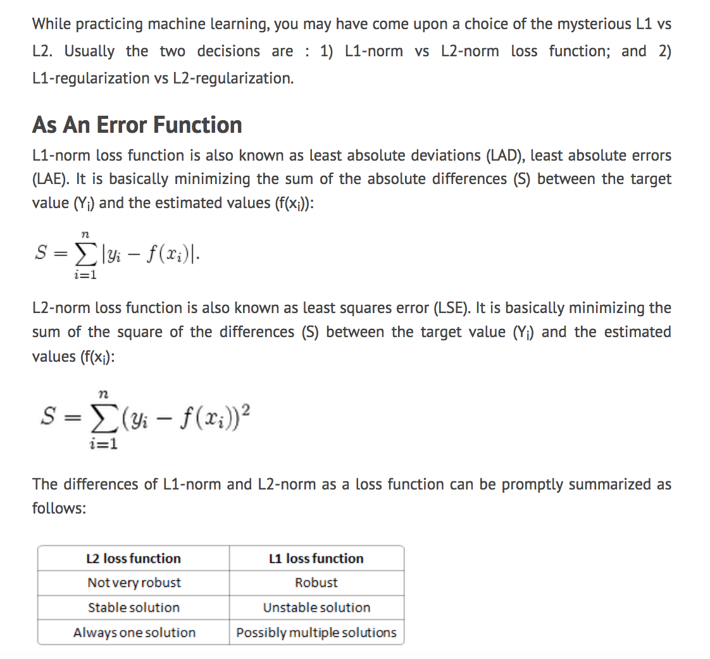

# Regularization

- Regularization is a very important technique in machine learning to prevent overfitting. Mathematically speaking, it adds a regularization term in order to prevent the coefficients to fit so perfectly as to overfit. 
- Regularization is important when we want to make sure we’re not overfitting our training model. 
- Regularization penalizes model complexity
- L1 regularization and L2 regularization are two closely related techniques that can be used by machine learning (ML) training algorithms to reduce model overfitting. Eliminating overfitting leads to a model that makes better predictions. 
- The ideas behind regularization are a bit tricky to explain, not because they’re difficult, but rather because there are several interrelated ideas

## L1 and L2
- They involve imposing a certain kind of penalty for choosing lines whose coefficients are large
- Features scaling (i.e. standardization) is necessary before regularization as it is scale-dependent

### Lasso (L1)
- Robert Tibshirani introduced Lasso in order to improve the prediction accuracy and interpretability of regression models by **altering the model fitting process to select only a subset of the provided covariates for use in the final model rather than using all of them.**
- penalty function is based on absolute value
- does not have a unique solution

#### L1 Limitations
- in the "large p, small n" case (high-dimensional data with few examples), the LASSO selects at most n variables before it saturates.
- if there is a group of highly correlated variables, then the LASSO tends to select one variable from a group and ignore the others.

### Ridge (L2)
- Ridge Regression is a technique for analyzing multiple regression data that suffer from multicollinearity. When multicollinearity occurs, least squares estimates are unbiased, but their variances are large so they may be far from the true value.
- has a unique solution

#### L2 Limitations
- doesn't give you explicit feature selection because variables are not eliminated (though their coefficients are set to a very small number)

### Key Difference
- The key difference between these techniques is that Lasso shrinks the coefficient of the less important features to 0 thus, removing some feature altogether.
- By L1 regularization, you essentially make the vector x smaller (sparse), as most of its components are useless (zeros), and at the same time, the remaining non-zero components are very “useful”.

---

## [Why Two Different Kinds of Regularization?](https://msdn.microsoft.com/en-us/magazine/dn904675.aspx)

L1 and L2 regularization are similar. Which is better? The bottom line is that even though there are some theory guidelines about which form of regularization is better in certain problem scenarios, in my opinion, in practice you must experiment to find which type of regularization is better, or whether using regularization at all is better.

As it turns out, using L1 regularization can sometimes have a beneficial side effect of driving one or more weight values to 0.0, which effectively means the associated feature isn’t needed. This is one form of what’s called feature selection. For example, in the demo run in Figure 1, with L1 regularization the last model weight is 0.0. This means the last predictor value doesn’t contribute to the LR model. 

**L2 regularization limits model weight values, but usually doesn’t prune any weights entirely by setting them to 0.0.**

So, it would seem that L1 regularization is better than L2 regularization. However, a downside of using L1 regularization is that the technique can’t be easily used with some ML training algorithms, in particular those algorithms that use calculus to compute what’s called a gradient. L2 regularization can be used with any type of training algorithm.

To summarize, L1 regularization sometimes has a nice side effect of pruning out unneeded features by setting their associated weights to 0.0 but L1 regularization doesn’t easily work with all forms of training. L2 regularization works with all forms of training, but doesn’t give you implicit feature selection. In practice, you must use trial and error to determine which form of regularization (or neither) is better for a particular problem.

## Elastic Net
Elastic Net combines L1 and L2

## Loss Functions

 

## Resources
- [Test Run - L1 and L2 Regularization for Machine Learning](https://msdn.microsoft.com/en-us/magazine/dn904675.aspx)

- [Elastic Net Regularization](https://en.wikipedia.org/wiki/Elastic_net_regularization)

- [Regularization for Regular People](http://jonhanke.github.io/Regularization-for-Regular-People/)

- [Differences between L1 and L2 as Loss Function and Regularization](http://www.chioka.in/differences-between-l1-and-l2-as-loss-function-and-regularization/) 

- [L1 Norm Regularization and Sparsity Explained for Dummies](https://medium.com/mlreview/l1-norm-regularization-and-sparsity-explained-for-dummies-5b0e4be3938a)

