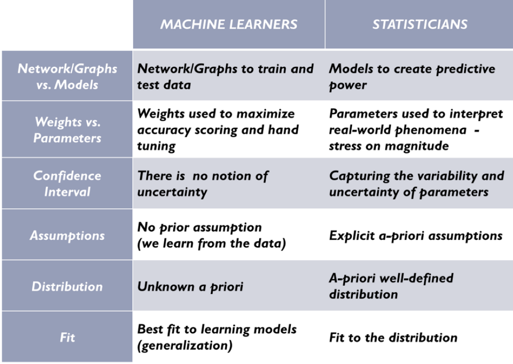

# What is the difference between statistics and machine learning?

## Goals by Discipline

 * Statistician
    * predict an interaction between variables with some degree of certainty (we are never 100% certain about anything)

 * Machine Learners - want to build algorithms that predict, classify and cluster with the most accuracy
    * operate without uncertainty or assumptions, continuously learning in order to improve their accuracy score

## Culture Differences in Machine Learners' and Statisticians' Approaches

 * Statisticians
    * must understand underlying distribution of the population under study
    * must come up with parameters that will provide predictive power

 * Machine Learners
    * want to build algorithms that predict, classify and cluster with the most accuracy

---

## Resources
- [Why a Mathematician, Statistician & Machine Learner Solve the Same Problem Differently](http://www.galvanize.com/blog/2015/08/26/why-a-mathematician-statistician-machine-learner-solve-the-same-problem-differently-2/#.Vha0zqJ33MP)

