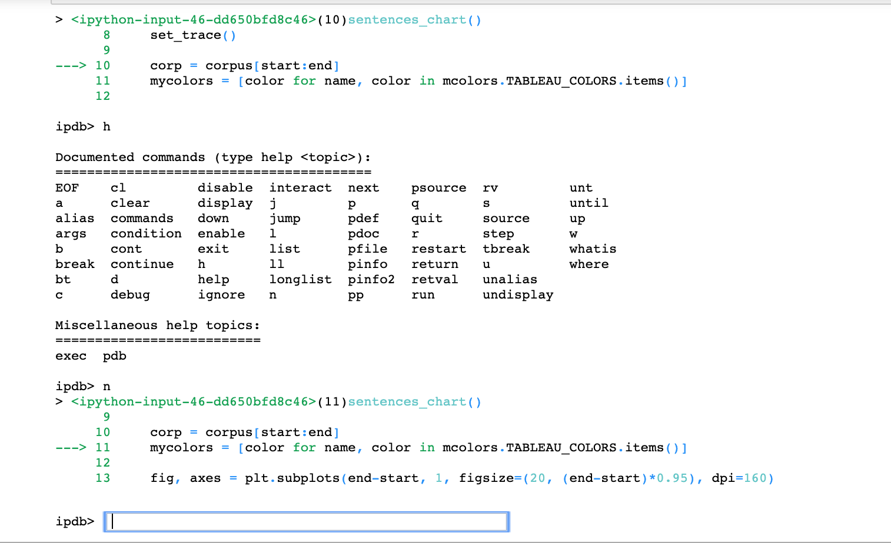

# Python Debugger
**Note:** notes here are from [fastai Lesson 8 Notes](https://github.com/reshamas/fastai_deeplearn_part1/blob/e35fce3a1248dc567893e47fe06e35465cf65728/courses/v2-dl2/lesson_08.md)
fastai video:  https://youtu.be/Z0ssNAbe81M?t=6306

- unfortunately, no one teaches basic software development skills in an academic program
- "wow, there's something that shows what your code does one step at a time!"
- note:  all programming languages have a debugger
- In Python, the standard debugger is called `pdb`

### 2 Ways to Use Python Debugger
1.  `pdb.set_trace()` to set a breakpoint  
2.  `%debug` magic to trace an error

### Using the debugger
- go inside your Python module, and add these lines: `pdb.set_trace()`
- can set a conditional breakpoint, where error is occurring
- fastai imports `pdb` for you
- to import:  `import pdb`
- it's not the most user-friendly experience
- "holy shit, the debugger even works in a Jupyter notebook!"
- it will also work in the terminal
- when running in Jupyter notebook, and box pops up, type `h` for **help**
- there are lots of tutorials there

## `pdb' Commands to Know
[pdb Documentation](https://docs.python.org/3/library/pdb.html)  

`h`  help  
`p`  print    [Example:  p <object> ]  
`n`  go to next line  
`s`  step into the function; don't skip over it  
`c`  continue until you hit next break point  
`u`  go up the callstack (get out of a property or function, go one level up)  
`d`  do down the callstack  
`l`  l(ist) [first[, last]]  
List source code for the current file. Without arguments, list 11 lines around the current line or continue the previous listing. With `.` as argument, list 11 lines around the current line. With one argument, list 11 lines around at that line. With two arguments, list the given range; if the second argument is less than the first, it is interpreted as a count.

The current line in the current frame is indicated by `->`. If an exception is being debugged, the line where the exception was originally raised or propagated is indicated by `>>`, if it differs from the current line.  

`exit`  exit debugger

### Commands you need to know
- s / n / c
- u / d
- p
- l

### sample screen

### more on debugging
- `from IPython.core.debugger import set_trace`  (get pretty colors)
- [Debugging Jupyter Notebooks](https://davidhamann.de/2017/04/22/debugging-jupyter-notebooks/)

## back to Debugging (`01:50`)
- debugging comes in handy with exceptions
- `%debug` pops open the debugger at the point where the exception happened
- Jeremy does all of his development, both of library and lessons, in Jupyter notebook, all interactively
- Jeremy uses `%debug` all of the time, along with the idea of copying code out of the function to a different cell and running it step by step
- there are similar things you can do inside of Visual Studio code, there is a Jupyter extension, which lets you select any line of code, and select option for running it in Jupyter, and create a little window showing you the output
- Personnally, Jeremy thinks Jupyter notebook is better, and perhaps by the time you watch this on video, Jupyter Labs will be the main thing. it's the next version of Jupyter notebooks

## Option 2:  `%debug`  
- type this in next cell after encountering an error

(debugging section ends at 1:53)
