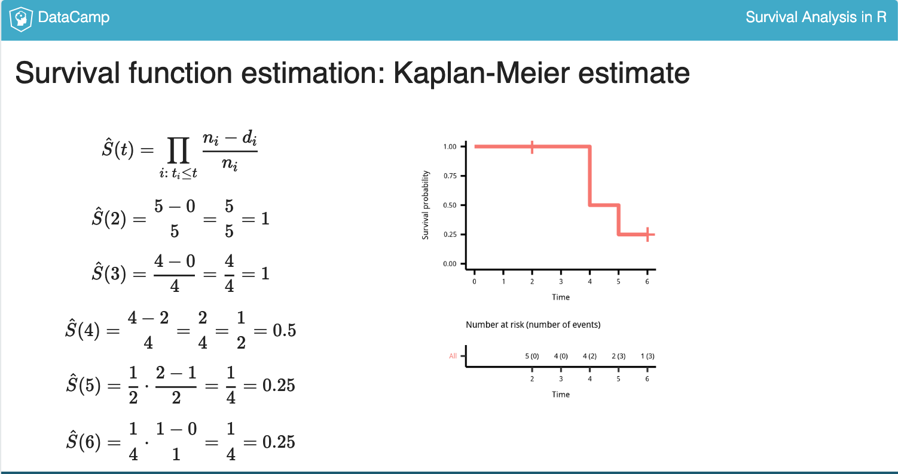

# Part 1:  What is survival analysis?


- DataCamp course:  [Survival Analysis in R](https://www.datacamp.com/courses/survival-analysis-in-r)
- survival analysis is:  **time to event data**
- time to:
  - death
  - find a new job
  - delivery of letter
  - how long to wait for cab to arrive
  - 
- we can't use linear models because:
  - duration times are always **positive**
  - need to work with distributions 
  - linear model assumes a normal distribution which is not appropriate for positive outcomes
- different **measures** are of interest
  - **hazard functions**
- **censoring** is almost always an issue
  - **right censoring** is the most common type of censoring in survival analysis
- 
  
## Weibull Distribution

  
---

## Getting the data

```r
# GBSG2: time to death of 686 breast cancer patients
data(GBSG2, package = "TH.data")
help(UnempDur, package = "Ecdat")
```

## Creating `Surv` objects
```r
time <- c(5, 6, 2, 4, 4)
event <- c(1, 0, 0, 1, 1)

library("survival")
Surv(time, event)
```

## R packages

#### for analyses:
```r
library("survival")
```

#### for pretty visualizations:
```r
library("survminer")
```


## Censoring
1 = event occurred  

```r
# Count censored and uncensored data
num_cens <- table(GBSG2$cens)
num_cens

# Create barplot of censored and uncensored data
barplot(num_cens)

# Use help() to look at cens
help(GBSG2, package = "TH.data")
```

```
# Create Surv-Object
sobj <- Surv(GBSG2$time, GBSG2$cens)

# Look at 10 first elements
sobj[1:10]

# Look at summary
summary(sobj)

# Look at structure
str(sobj)
```

```r
# Load the UnempDur data
data(UnempDur, package = "Ecdat")

# Count censored and uncensored data
cens_employ_ft <- table(UnempDur$censor1)
cens_employ_ft

# Create barplot of censored and uncensored data
barplot(cens_employ_ft)

# Create Surv-Object
sobj <- Surv(UnempDur$spell, UnempDur$censor1)

# Look at 10 first elements
sobj[1:10]
```

---
# Part 2:  Estimation of Survival Curves

## Survival Function
- Theory:  `S(t) = 1 - F(t) = P(T > t)`
- `F(t)` is the cumulative distribution function
- Interpretation:  Probability that duration is longer than `t` [for any point in time]

## Part 2:  Estimation of Survival Curves

### Kaplan-Meier Estimate


To compute the Kaplan-Meier estimate:  
```r
km <- survfit(Surv(time, event) ~ 1)
```
- `~1` means we want to compute one survival function for all observations

To produce the plot, use this code:  
- `conf_int` specify whether or not you want a confidence interval
- `risk.table = "nrisk_cumevents` means we would like to see a table with number of individuals under observation and the sum of events in brackets
- `legend = "none"` because we only have one curve

```r
ggsurvplot(km, conf.int = FALSE,
  risk.table = "nrisk_cumevents",
  legend = "none")
```

Examples from here:  https://stat.ethz.ch/R-manual/R-devel/library/survival/html/summary.survfit.html
```r
summary( survfit( Surv(futime, fustat)~1, data=ovarian))
summary( survfit( Surv(futime, fustat)~rx, data=ovarian))
```

### example
```r
> # Create time and event data
> time <- c(5, 6, 2, 4, 4)
> event <- c(1, 0, 0, 1, 1)
> 
> # Compute Kaplan-Meier estimate
> km <- survfit(Surv(time, event) ~ 1)
> km
Call: survfit(formula = Surv(time, event) ~ 1)

      n  events  median 0.95LCL 0.95UCL 
    5.0     3.0     4.5     4.0      NA
> 
> # Take a look at the structure
> str(km)
List of 13
 $ n        : int 5
 $ time     : num [1:4] 2 4 5 6
 $ n.risk   : num [1:4] 5 4 2 1
 $ n.event  : num [1:4] 0 2 1 0
 $ n.censor : num [1:4] 1 0 0 1
 $ surv     : num [1:4] 1 0.5 0.25 0.25
 $ type     : chr "right"
 $ std.err  : num [1:4] 0 0.5 0.866 0.866
 $ lower    : num [1:4] 1 0.1877 0.0458 0.0458
 $ upper    : num [1:4] 1 1 1 1
 $ conf.type: chr "log"
 $ conf.int : num 0.95
 $ call     : language survfit(formula = Surv(time, event) ~ 1)
 - attr(*, "class")= chr "survfit"
> 
> # Create data.frame
> data.frame(time = km$time, n.risk = km$n.risk, n.event = km$n.event,
    n.censor = km$n.censor, surv = km$surv)
  time n.risk n.event n.censor surv
1    2      5       0        1 1.00
2    4      4       2        0 0.50
3    5      2       1        0 0.25
4    6      1       0        1 0.25
> 
```

Note:  the Kaplan-Meier curve drops **when a patient dies.**  

---

## Understanding and Visualizing Kaplan-Meier Curves

```r
library(survminer)
ggsurvplot(fit)

ggsurvplot(
  fit,
  palette = NULL,
  linetype = 1,
  surv.median.line = "none",
  risk.table = FALSE,
  cumevents = FALSE,
  cumcensor = FALSE,
  tables.height = 0.25,
  ...
)
```
```r
ggsurvplot(
  fit = km,
  palette = "blue",
  linetype = 1,
  surv.median.line = "hv",    # hv = horizontal and vertical
  risk.table = TRUE,
  cumevents = TRUE,
  cumcensor = TRUE,
  tables.height = 0.1
)
```
```r
# Create dancedat data
dancedat <- data.frame(
  name = c("Chris", "Martin", "Conny", "Desi", "Reni", "Phil", 
    "Flo", "Andrea", "Isaac", "Dayra", "Caspar"),
  time = c(20, 2, 14, 22, 3, 7, 4, 15, 25, 17, 12),
  obs_end = c(1, 1, 0, 1, 1, 1, 1, 1, 0, 0, 0))

# Estimate the survivor function pretending that all censored observations are actual observations.
km_wrong <- survfit(Surv(time) ~ 1, data = dancedat)

# Estimate the survivor function from this dataset via kaplan-meier.
km <- survfit(Surv(time, obs_end) ~ 1, data = dancedat)

# Plot the two and compare
ggsurvplot_combine(list(correct = km, wrong = km_wrong))
```

See how ignoring censoring underestimates your friends' dancing stamina? **The correct analysis (red curve) shows that your friends actually dance longer than the incorrect blue curve suggests.**

```
# Kaplan-Meier estimate
km <- survfit(Surv(time, cens)~ 1, data = GBSG2)

# plot of the Kaplan-Meier estimate
ggsurvplot(km)

# add the risk table to plot
ggsurvplot(km, risk.table = TRUE)

# add a line showing the median survival time
ggsurvplot(km, risk.table = TRUE, surv.median.line = "hv")
```

## The Weibull Model for Estimating Survival Curves
- KM estimate is used mainly as a descriptive tool for looking at the data
  - it estimates the survival curve with a step function
- the Weibull model produces a survival curve that is not a step function but it is smooth
  - has the ability to adjust for covariates and inferences
  
### Computing a Weibull Model in R
- notice that `survreg` is used here instead of `survfit`
```r
wb <- survreg(Surv(time, event) ~ 1, data)
```
- to compute:  90% of patients survive beyond a certain time point:  
```r
predict(wb, type="quantile", p = 1-0.9, newdata = data.frame(1) )
       1
384.9947
```
- `p = 1 - 0.9` because the distribution function is `1 - survival_function`
- to conclude, 90% of patients survive more than 384 days

### Computing the survival function from the Weibull Model
```r
wb <- survreg(Surv(time, cens) ~ 1, data = GBSG2)
```
- to plot the survival function, let's create a grid for many quantiles
```r
surv <- seq(.99, .01, by = -.01)
```


  


